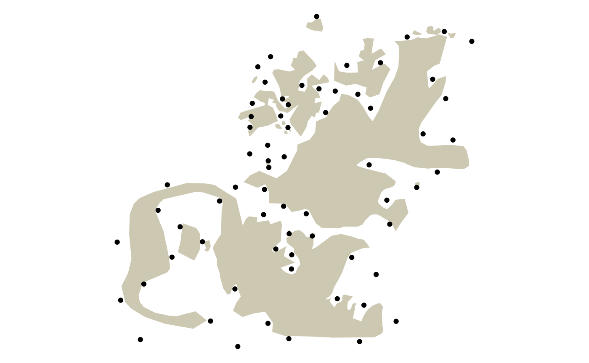
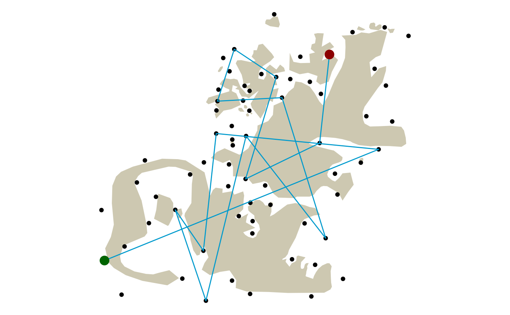
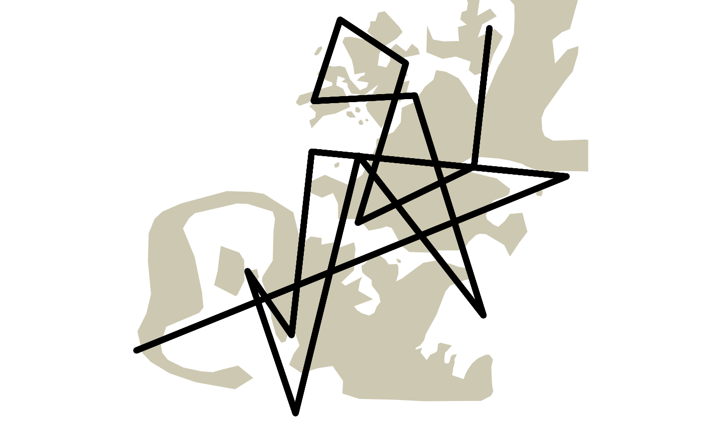
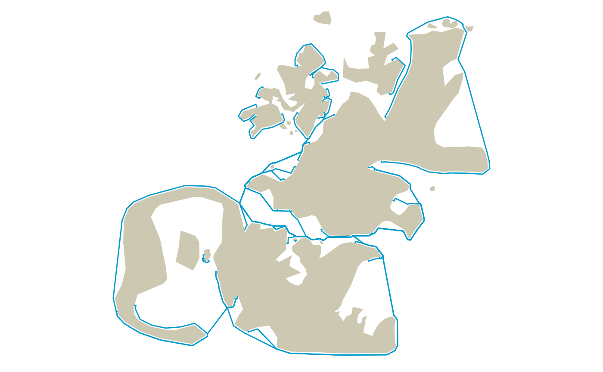
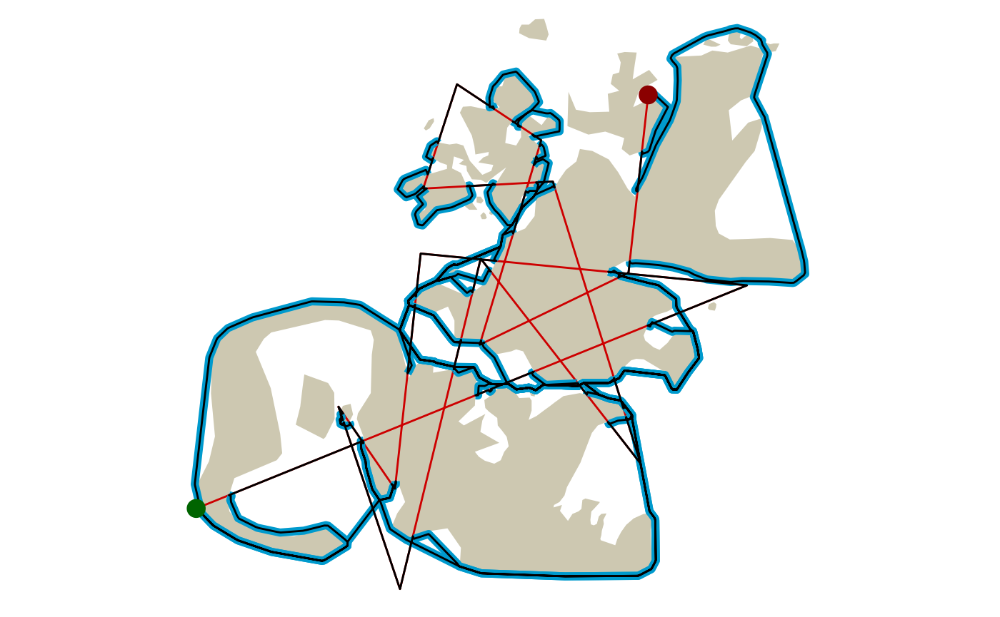

# Re-routing Straight Line Paths Around Barriers - A Visibility Graph Demo

This vignette demonstrates the basic concept within the `{pathroutr}`
package for re-routing paths that cross a barrier around said barrier
using the shortest path (weighted by distance) through a visibility
graph.

The larger intent is to use this approach for adjusting the movement
tracks of marine animals through water when estimated paths from
movement models or other estimation approaches incorrectly cross land.

``` r

library(pathroutr)
data(land_barrier)
data(poi)
```

## The Test Environment

``` r

library(dplyr)
library(ggplot2)
library(sf)
library(ggspatial)
```

First, let’s setup our test space with our included land barrier and
points of interest. This was based off of the north Kodiak Island region
in Alaska, USA (but, is not an exact replica. So, not for navigational
use!!).

``` r

ggplot() + 
  ggspatial::annotation_spatial(data = land_barrier, 
                                fill = "cornsilk3", size = 0) +
  ggspatial::layer_spatial(data = poi) +
  theme_void()
```



The complexity of the nearshore environment with small islands and
narrow passages is a difficult situation for estimating marine animal
tracks from telemetry devices that often have error associated with the
location estimates.

Here, we sample 15 of our points of interest and, then, connect them as
a line representing a path across our complicated landscape.

``` r

l_pts <- poi %>% slice_sample(n = 15)
path <- l_pts %>% summarise(do_union = FALSE) %>% st_cast('LINESTRING')

ggplot() + 
  ggspatial::annotation_spatial(land_barrier, fill = "cornsilk3", size = 0) +
  ggspatial::layer_spatial(poi) +
  ggspatial::layer_spatial(path, color = "deepskyblue3") +
  ggspatial::layer_spatial(l_pts[1,], color = "darkgreen", size = 4) +
  ggspatial::layer_spatial(l_pts[15,], color = "darkred", size = 4) +
  theme_void()
```



Now, let’s sample 10000 points along this string and this will represent
our simulated path of track observations.

``` r

track_pts <- st_sample(path, size = 10000, type = "regular")

ggplot() + 
  ggspatial::annotation_spatial(land_barrier, fill = "cornsilk3", size = 0) +
  ggspatial::layer_spatial(path, color = "deepskyblue3") +
  ggspatial::layer_spatial(track_pts) +
  theme_void()
```



## Re-route the path

The first function we’ll use from the `{pathroutr}` package is
[`get_barrier_segments()`](../reference/get_barrier_segments.md) which
identifies all of the consecutive track points that intersect with the
land barrier. The result of this function is a tibble that stores the
key metadata about each of the segments identified to cross land. The
*start_idx* and *end_idx* columns store the row index of the two points
that bookend each stretch of consecutive points that intersect with the
barrier polygon. These points DO NOT intersect with the barrier. The
*n_pts* column is the number of consecutive points that intersect with
the barrier. Lastly, the *start_pt* and *end_pt* columns store the
Simple Feature geometry for the bookend points represented by
*start_idx* and *end_idx*. Later, these geometries will be used to
identify the nearest node in our network for shortest path routing and
the final, updated path will start and end with these geometries.

``` r

segs_tbl <- get_barrier_segments(track_pts,land_barrier)
segs_tbl
#> # A tibble: 28 × 6
#>      sid start_idx end_idx n_pts            start_pt
#>    <int>     <dbl>   <dbl> <dbl>         <POINT [m]>
#>  1     1        22     110    87 (66157.77 935452.6)
#>  2     2       556     929   372 (74925.92 939009.7)
#>  3     3       972     980     7 (81756.53 941780.7)
#>  4     4      1123    1501   377 (84235.92 942786.5)
#>  5     5      2261    2607   345 (88290.71 948242.9)
#>  6     6      2974    3000    25 (77804.18 946898.4)
#>  7     7      3213    3547   333 (77344.42 942688.5)
#>  8     8      3589    3742   152 (76473.59 936651.4)
#>  9     9      3819    3853    33 (74165.59 940010.3)
#> 10    10      3921    3929     7 (73816.81 940150.1)
#> # ℹ 18 more rows
#> # ℹ 1 more variable: end_pt <POINT [m]>
```

Our next step is to create a visibility graph. This is, essentially, a
road network for our marine environment. In simple terms, we connect all
of the vertices for our barrier polygon with a Delaunay triangle mesh
and, then, remove any of the edges that cross land. Our
[`prt_visgraph()`](../reference/prt_visgraph.md) function returns an
undirected graph of type *sfnetwork* created with the
[sfnetworks](https://luukvdmeer.github.io/sfnetworks/) package. Edge
lengths are stored as a weight attribute for our visibility graph.

The most computationally intensive step is likely to be identification
of which edges intersect with the barrier polygon. We try to minimize
this by, first, buffering the barrier by -1 meter and then calling
`sf::st_intersect()`. Because all of the nodes in our network are also
vertices in our barrier polygon, all edges intersect with the barrier
polygon. By buffering by -1 meter, we disconnect the nodes. If we didn’t
do this, we would need to evaluate two spatial predicate functions
([`sf::st_crosses()`](https://r-spatial.github.io/sf/reference/geos_binary_pred.html)
and
[`sf::st_within()`](https://r-spatial.github.io/sf/reference/geos_binary_pred.html)).
With the negative buffer adjustment, we can rely solely on
`sf::st_intersect()`. The other step we do to minimize compute time is
to NOT evaluate which edges intersect with the barrier polygon feature.
Instead we evaluate which polygon features intersect with which edges.
Because `sf::st_intersect()` evaluates row wise, this minimizes the
number of evaluations since the number of polygon features in barrier is
always going to be much much smaller than the number of edges.

``` r

vis_graph <- prt_visgraph(land_barrier, buffer = 150)
```

In previous development versions of {pathroutr} we relied on the
{stplanr} package. Now, we rely on {sfnetworks} and one advantage of
this approach is that we can use the
[`sfnetworks::st_network_blend()`](https://luukvdmeer.github.io/sfnetworks/reference/st_network_blend.html)
function to integrate our segment start and end points into the network.
Previously, the nearest existing network node to the start/end points
was used as the start and end of the shortest path calculation. A
straight line was, then, drawn between the start/end points to the start
and end of the path to complete the re-routed track segment. The
[`sfnetworks::st_network_blend()`](https://luukvdmeer.github.io/sfnetworks/reference/st_network_blend.html)
function provides a more robust solution by creating new network nodes
on an existing edge at the closest point from the provided segment start
and end points. These new network nodes serve as start and end points
for the shortest path. And, as before, we extend the path to include the
segment start and end points.

Additionally, we now also conduct an integrity check of the newly
created `LINESTRING` to ensure the directionality is consistent
(e.g. the first node in the `LINESTRING` is the segment start point).
This should resolve any previous issues that created spurious line
segments that diverged from the determined shortest path.

``` r

segs_tbl <- segs_tbl %>% prt_shortpath(vis_graph, blend = TRUE)

ggplot() + 
  ggspatial::annotation_spatial(land_barrier, fill = "cornsilk3", size = 0) +
  ggspatial::layer_spatial(segs_tbl$geometry, color = "deepskyblue3") +
  theme_void()
```



This process of

1.  [`get_barrier_segments()`](../reference/get_barrier_segments.md)
2.  [`prt_shortpath()`](../reference/prt_shortpath.md)

are likely to be the same across most workflows. So, the
[`prt_reroute()`](../reference/prt_reroute.md) function exists to
simplify the process for the user. In short, this function calls the two
functions above along with some error handling and data checking. In the
example code below [`prt_reroute()`](../reference/prt_reroute.md) is
followed up with a call to
[`prt_update_points()`](../reference/prt_update_points.md). For even
more efficient coding, the `%>%` function could be used to pipe the
result from [`prt_reroute()`](../reference/prt_reroute.md) into
[`prt_update_points()`](../reference/prt_update_points.md). The result
will be a version of `track_pts` with the re-routed geometry updated in
place. Users may want to construct their own function for updating
points while also tracking which rows were updated and adjusting other
column values as needed.

``` r

track_pts_fix <- prt_reroute(track_pts, land_barrier, vis_graph, blend = TRUE)

track_pts_fix <- prt_update_points(track_pts_fix, track_pts)
```

## Did it work?

A final plot of our corrected path. The green dot is the start and the
red dot then end. The blue line is the shortest path fix and the black
line is the new path. Red line represents the original path.

If everything is working correctly, there should not be any black lines
crossing land.

``` r

track_pts <- track_pts %>% st_cast('LINESTRING')
track_line_fixed <- track_pts_fix %>% summarise(do_union = FALSE) %>% st_cast('LINESTRING')

ggplot() + 
  ggspatial::annotation_spatial(land_barrier, fill = "cornsilk3", size = 0) +
  ggspatial::layer_spatial(track_pts, color = "red3") +
  ggspatial::layer_spatial(segs_tbl$geometry, color = "deepskyblue3", size = 2) +
  ggspatial::layer_spatial(track_line_fixed) +
  ggspatial::layer_spatial(l_pts[1,], color = "darkgreen", size = 4) +
  ggspatial::layer_spatial(l_pts[15,], color = "darkred", size = 4) +
  theme_void()
```


